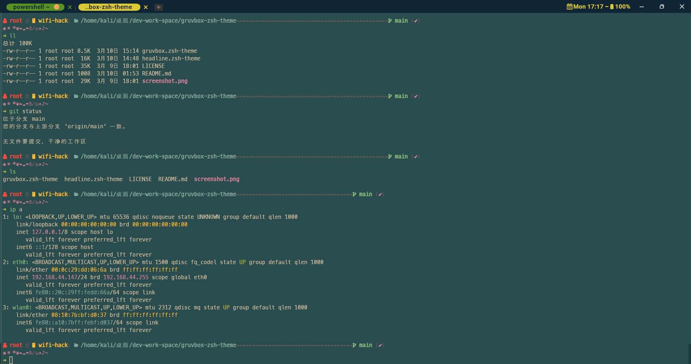

# 我的 WezTerm 配置

> [基于 QianSong1/wezterm-config 改造](https://github.com/QianSong1/wezterm-config)



## 前提条件

安装`wezterm`终端

## 使用方法

将文件放入：`$HOME/.config/wezterm`

## 问题

1. 闪退：试着修改`$HOME/.config/wezterm/config/appearance.lua`中的`front_end`配置项

## 快捷键

```bash
#快捷键
Ctrl+shift+c    --复制
Ctrl+shift+v    --粘贴
Ctrl+shift+r    --重命名标签栏
Ctrl+alt+[\]    --水平拆分窗格，即左右拆分
Ctrl+alt+[/]    --垂直拆分窗格，即上下拆分
Ctrl+alt+[-]    --关闭当前窗格
Ctrl+alt+z      --最大化/最小化当前窗格
F11             --全屏
Ctrl+alt+[↑]    --向上扩展窗格
Ctrl+alt+[↓]    --向下扩展窗格
Ctrl+alt+[←]    --向左扩展窗格
Ctrl+alt+[→]    --向右扩展窗格
Alt+[↑]         --放大字体
Alt+[↓]         --缩小字体
Alt+r           --重置字体大小
```

> TODO:配置各平台快捷键
